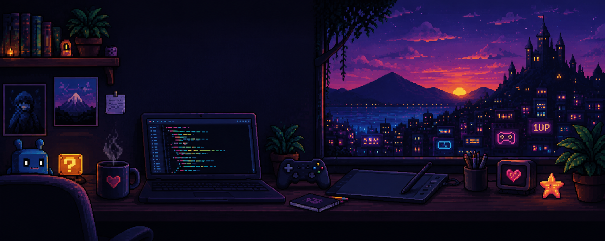

# Professional GitHub Profile README

  

# Hello, I'm Elton 👋

I'm a Computer Science student with an interest in **Game Development** and **Graphics Programming**. I enjoy exploring the intersection of technology, creativity, games, and art.

## About Me

* 🎓 Computer Science student
* 🎮 Interested in Game Development and Graphics Programming
* 🎨 Interested in the relationship between technology, games, and art
* 🚀 Focused on continuous learning through study and personal projects

## Currently Learning

* Algorithms
* Database Fundamentals
* Front-end Web Development

## Technologies

**Programming Languages**

Python · C

**Web Development**

HTML · CSS

## Areas of Interest

* Game Development
* Graphics Programming
* Algorithms and Problem Solving
* Interactive Applications

## Goals

* Strengthen my programming and problem-solving skills
* Develop projects that combine technology and creativity
* Explore Game Development and Graphics Programming in greater depth
* Continuously expand my knowledge through practice and personal projects

## Projects

> Work in progress.

## Contact

> (https://www.linkedin.com/in/elton-santos-soares-029769431/)

---

  Thanks for visiting my profile.

